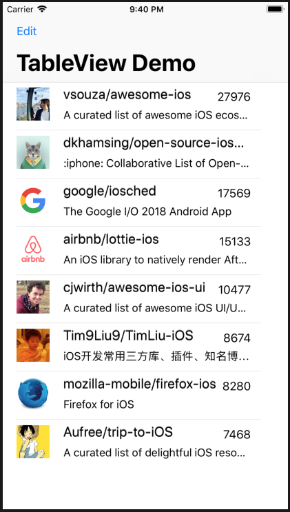

# ios-tableview-demo
Tableview Demo with custom data controller, editing and reordering

## Screenshot

## Components and APIs used

* UITableView component
  * Custom UITableViewCell view 
  * Custom UITableViewDataSource datasource
* URLSession data tasks for downloading content
  * Github API data (Repository search https://api.github.com/search/repositories?q=ios)
  * GitHub image for user avatars

